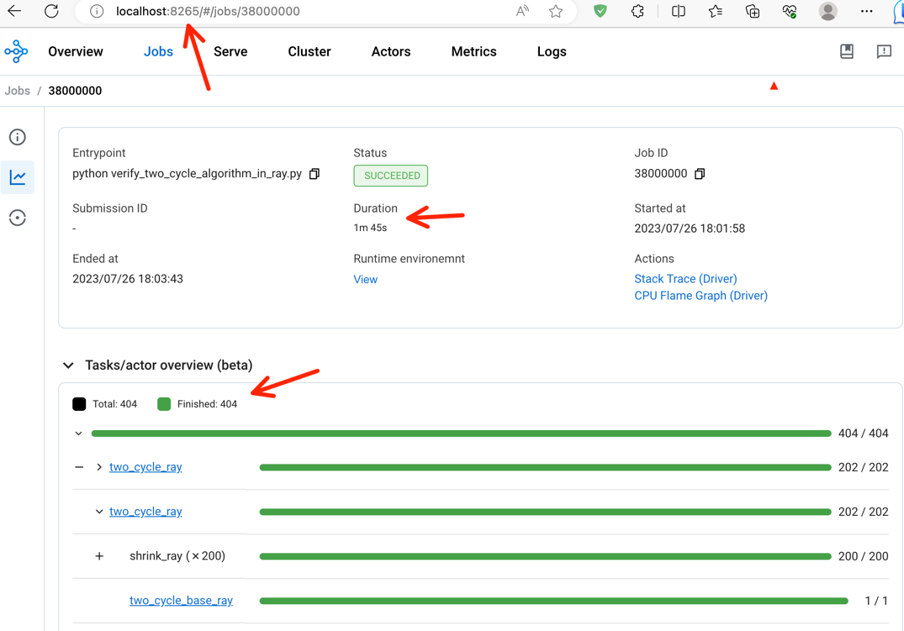
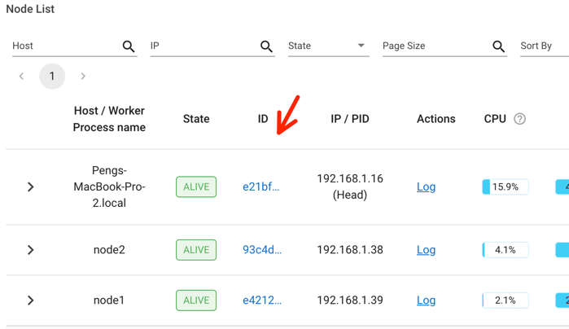
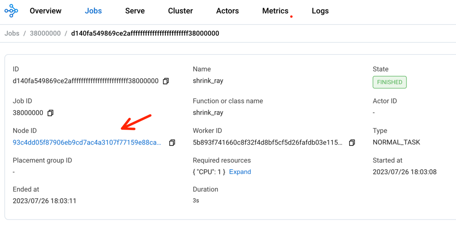
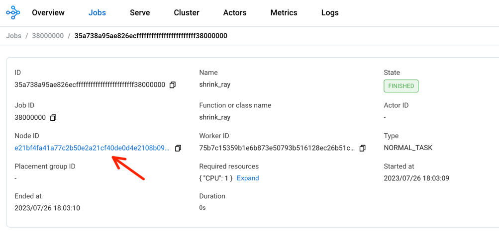
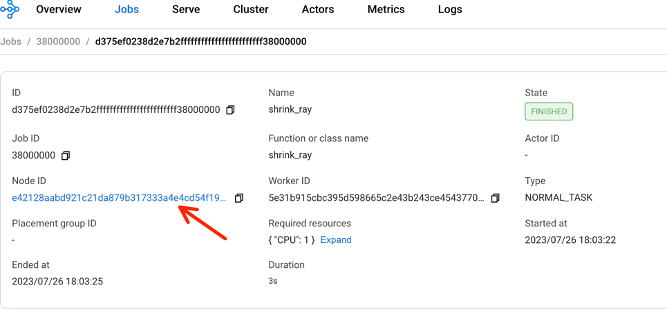

# Two Cycle

Given a undirected graph G. G is either a cycle or a graph of two disjoint cycles. Implement an algorithm to tell
whether G is a cycle.

## Run in one process.
We first implement the algorithm that runs in one process, i.e., run locally without using Ray.
The algorithm is at [two_cycle_algorithm.py](two_cycle_algorithm.py). It can run on two types of graphs:

1. graphs stored in memory. See [cycle_graph_in_memory.py](cycle_graph_in_memory.py)
2. graphs stored in Postgres. See [cycle_graph_in_postgres.py](cycle_graph_in_postgres.py)

Both types of graph implement the graph interface defined at  [cycle_graph.py](cycle_graph.py).

The driver is [verify_two_cycle_algorithm_in_one_process.py](verify_two_cycle_algorithm_in_one_process.py)
```shell
# install the postgres client driver
pip install psycopg2
# start a postgres server and run this program
docker run -d --name=pg -p 15432:5432 -e POSTGRES_PASSWORD=postgres postgres

# at the folder two-cycle.
python verify_two_cycle_algorithm_in_one_process.py
```
You should see results like following. 
```text
verify algorithm on graphs stored in postgres
a graph of two cycles. 10000 vertices
success
Runtime: 8.08 seconds
a cycle. 10000 vertices
success
Runtime: 8.19 seconds
```

## Run in the Ray cluster.
The driver is [verify_two_cycle_algorithm_in_ray.py](verify_two_cycle_algorithm_in_ray.py)
```shell
# at the folder two-cycle.
python verify_two_cycle_algorithm_in_one_process.py
```
You should see results like following.
```text
[2023-07-26 18:01:58,780 I 24742 590395] global_state_accessor.cc:356: This node has an IP address of 127.0.0.1, but we cannot find a local Raylet with the same address. This can happen when you connect to the Ray cluster with a different IP address or when connecting to a container.
2023-07-26 18:01:58,808 INFO worker.py:1612 -- Connected to Ray cluster. View the dashboard at 127.0.0.1:8265 
2023-07-26 18:01:58,812 INFO packaging.py:518 -- Creating a file package for local directory './'.
2023-07-26 18:01:58,813 INFO packaging.py:346 -- Pushing file package 'gcs://_ray_pkg_a04d88ee204c1cf2.zip' (0.03MiB) to Ray cluster...
2023-07-26 18:01:58,814 INFO packaging.py:359 -- Successfully pushed file package 'gcs://_ray_pkg_a04d88ee204c1cf2.zip'.
a graph of two cycles. 10000 vertices
success
Runtime: 50.80 seconds
a cycle. 10000 vertices
success
Runtime: 35.71 seconds
```

Connect to the Ray console at the Ray head node. 

Here is a view of the 3 nodes cluster. 

Here are three tasks running on each of the cnode.



